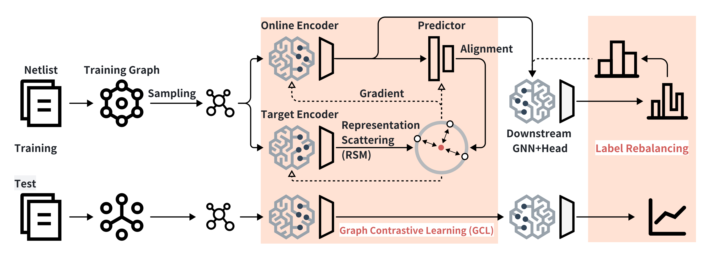
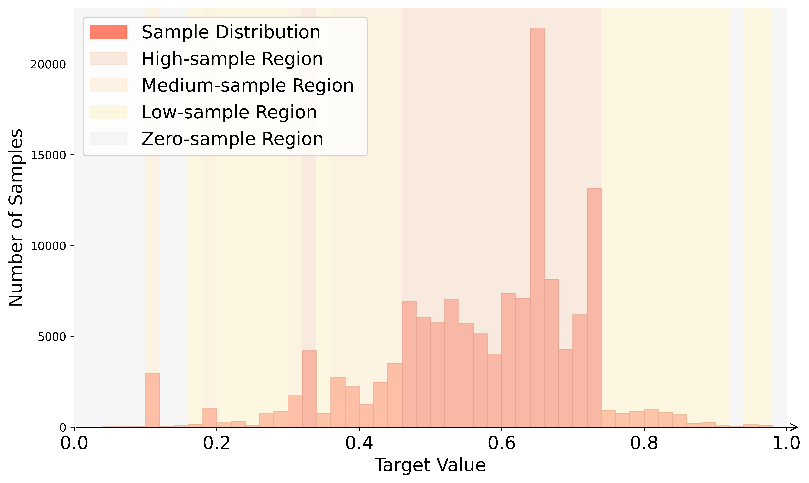

# CircuitGCL: Transferable Parasitic Estimation via Graph Contrastive Learning and Label Rebalancing in AMS Circuits

[](https://opensource.org/licenses/MIT)
[](https://www.python.org/downloads/release/python-310/)
[](https://pytorch.org/)
[](https://pytorch-geometric.readthedocs.io/)

Official implementation of the paper "Transferable Parasitic Estimation via Graph Contrastive Learning and Label Rebalancing in AMS Circuits".

## 📑 Table of Contents

- [Overview](#overview)
- [Key Features](#key-features)
- [Repository Structure](#repository-structure)
- [Installation](#installation)
- [Usage](#usage)
  - [Dataset Preparation](#dataset-preparation)
  - [Model Training](#model-training)
  - [Evaluation](#evaluation)
- [Framework Components](#framework-components)
- [Results](#results)
- [Citation](#citation)
- [License](#license)

## 🔍 Overview

CircuitGCL is a novel framework for accurate parasitic capacitance prediction in analog and mixed-signal (AMS) circuits using advanced graph neural networks. Our approach enables efficient and accurate parasitic estimation across different circuit designs, significantly reducing the need for expensive SPICE simulations during the circuit design process.

Our framework supports four key parasitic estimation tasks:

- Coupling Capacitance Regression/Classification
- Ground Capacitance Regression/Classification:



## ✨ Key Features

CircuitGCL addresses two major challenges in parasitic estimation:

1. **Enhanced Transferability** - Through self-supervised graph contrastive learning (SGRL), our model can generalize knowledge across different circuit designs
2. **Robust Label Handling** - Using specialized loss functions and rebalancing strategies to address the severe imbalance in parasitic capacitance distributions
3. **State-of-the-Art Performance** - Significant improvements in parasitic prediction accuracy compared to existing methods


## 📁 Repository Structure

```
.
├── balanced_mse.py          # Implementation of balanced MSE loss functions
├── downstream_train.py      # Training script for downstream tasks
├── main.py                  # Main entry point for the training pipeline
├── model.py                 # GNN model architecture definitions
├── requirements.txt         # Python dependencies
├── sampling.py              # Graph sampling utilities
├── sgrl_models.py           # Self-supervised graph contrastive learning models
├── sgrl_train.py            # Training script for contrastive learning
├── sram_dataset.py          # Dataset loading and preprocessing
└── utils.py                 # Utility functions
```

## 💻 Installation

### Prerequisites

- Python 3.10+
- CUDA-compatible GPU (recommended)

### Setup Instructions

```bash
# Clone the repository
git clone https://github.com/username/CircuitGCL.git
cd CircuitGCL

# Create and activate a conda environment
conda create -n circuitgcl python=3.10
conda activate circuitgcl

# Install dependencies
pip install -r requirements.txt
```

## 🚀 Usage

### Dataset Preparation

#### Dataset Download Instructions

The datasets used for training and testing CircuitGCL are available for download via the following links. You can use `curl` to directly download these files from the provided URLs.

##### List of Datasets

| Dataset Name    | Description                          | Download Link                                                                              |
| --------------- | ------------------------------------ | ------------------------------------------------------------------------------------------ |
| SSRAM           | Static Random Access Memory dataset  | [Download](https://circuitgcl-sram.s3.ap-southeast-2.amazonaws.com/raw/ssram.pt)           |
| DIGITAL_CLK_GEN | Digital Clock Generator dataset      | [Download](https://circuitgcl-sram.s3.ap-southeast-2.amazonaws.com/raw/digtime.pt)         |
| TIMING_CTRL     | Timing Control dataset               | [Download](https://circuitgcl-sram.s3.ap-southeast-2.amazonaws.com/raw/timing_ctrl.pt)     |
| ARRAY_128_32    | Array with dimensions 128x32 dataset | [Download](https://circuitgcl-sram.s3.ap-southeast-2.amazonaws.com/raw/array_128_32_8t.pt) |
| ULTRA8T         | Ultra 8 Transistor dataset           | [Download](https://circuitgcl-sram.s3.ap-southeast-2.amazonaws.com/raw/ultra8t.pt)         |
| SANDWICH-RAM    | Sandwich RAM dataset                 | [Download](https://circuitgcl-sram.s3.ap-southeast-2.amazonaws.com/raw/sandwich.pt)        |
| SP8192W         | Specialized 8192 Width dataset       | [Download](https://circuitgcl-sram.s3.ap-southeast-2.amazonaws.com/raw/sp8192w.pt)         |

##### Using `curl` to Download

To download any of the datasets using `curl`, you can use the following command format in your terminal:

```bash
curl -O <download_link>
```

For example, to download the SSRAM dataset, you would run:

```bash
curl -O https://circuitgcl-sram.s3.ap-southeast-2.amazonaws.com/raw/ssram.pt
```

Replace `<download_link>` with the appropriate URL from the table above.

##### Dataset Statistics

Below is a summary of the statistics for each dataset as used in our experiments:

| Split       | Dataset         | N    | NE    | #Links |
| ----------- | --------------- | ---- | ----- | ------ |
| Train.&Val. | SSRAM           | 87K  | 134K  | 131K   |
| Test        | DIGITAL_CLK_GEN | 17K  | 36K   | 4K     |
|             | TIMING_CTRL     | 18K  | 44K   | 5K     |
|             | ARRAY_128_32    | 144K | 352K  | 110K   |
|             | ULTRA8T         | 3.5M | 13.4M | 166K   |
|             | SANDWICH-RAM    | 4.3M | 13.3M | 154K   |

Note: The number of nodes (N), edges (NE), and links (#Links) are provided for reference to give an idea of the scale and complexity of each dataset.

---

#### Dataset Usage

Place your circuit datasets in the `./datasets/raw/` directory. The framework supports multiple SRAM circuit designs:

```
datasets/raw/
├── ssram.pt
├── digtime.pt
├── timing_ctrl.pt
├── array_128_32_8t.pt
├── ultar8t.pt
├── sandwich.pt
└── ...
```

### Model Training

#### Basic Training

```bash
# For node classification task
python main.py --dataset ssram+digtime+timing_ctrl+array_128_32_8t --task classification --task_level node --batch_size 128

# For edge regression task with GAI loss
python main.py --dataset ssram+digtime+timing_ctrl+array_128_32_8t --task regression --task_level edge --regress_loss gai --batch_size 128
```

#### With Contrastive Learning

```bash
# Enable contrastive learning pre-training
python main.py --dataset ssram+digtime+timing_ctrl+array_128_32_8t --task classification --sgrl 1 --cl_epochs 800
```

### Key Arguments

| Argument         | Description                          | Options                                                   |
| ---------------- | ------------------------------------ | --------------------------------------------------------- |
| `--task`         | Task type                            | `classification`, `regression`                            |
| `--task_level`   | Prediction level                     | `node`, `edge`                                            |
| `--dataset`      | Names of datasets (separated by `+`) | e.g., `ssram+digtime`                                     |
| `--model`        | GNN model architecture               | `clustergcn`, `resgatedgcn`, `gat`, `gcn`, `sage`, `gine` |
| `--sgrl`         | Enable contrastive learning          | `0` (disabled), `1` (enabled)                             |
| `--regress_loss` | Regression loss function             | `mse`, `gai`, `bmc`, `bni`, `lds`                         |
| `--class_loss`   | Classification loss function         | `bsmCE`, `focal`, `cross_entropy`                         |
| `--batch_size`   | Training batch size                  | Integer (default: `128`)                                  |
| `--cl_epochs`    | Contrastive learning epochs          | Integer (default: `500`)                                  |

## 🧠 Framework Components

### 1. Self-supervised Graph Contrastive Learning (SGRL)

Our SGRL module enables better transferability across different circuit designs by learning circuit structure representations without relying on parasitic labels. Key features include:

- Structure-aware graph augmentation strategies
- Circuit-specific positive/negative sampling techniques
- Efficient contrastive objective functions

### 2. Graph Neural Network Architectures

Multiple state-of-the-art GNN architectures are supported:

- **Graph Convolutional Network (GCN)** - For basic graph representation learning
- **GraphSAGE** - For efficient neighborhood sampling and aggregation
- **Graph Attention Network (GAT)** - For attention-based message passing
- **Residual Gated GCN** - For complex edge-conditioned convolutions
- **Graph Isomorphism Network with Edge features (GINE)** - For enhanced expressivity
- **Cluster GCN** - For efficient training on large circuit graphs

### 3. Label Rebalancing Strategies

Several advanced techniques are implemented to handle the severely imbalanced distribution of parasitic capacitance values:

- **Generative-based Adaptive Importance Loss (GAI)** - Our proposed approach that adaptively weights samples based on frequency distribution
- **Balanced MSE Loss** - Reweights the loss based on inverse sample frequency
- **Balanced Negative Sampling** - Improves representation learning for rare parasitic values
- **Local Distribution Smoothing (LDS)** - Reduces distribution bias during training
- **Focal Loss** - Focuses on hard-to-predict parasitic values

## 📊 Results

Our approach achieves superior performance compared to existing methods in both cross-circuit parasitic prediction accuracy and handling of imbalanced parasitic distributions.

### Label Distribution Analysis



### Performance Improvements


### Comprehensive Error Comparison

Our comprehensive experiments demonstrate significant improvements over state-of-the-art methods:

- Up to **42.48%** reduction in MSE
- Up to **41.08%** improvement in R²
- Consistently better performance across different circuit designs

#### Complete Performance Comparison Table

| Testset              | timectrl  |            |            |            | array     |            |            |            | ultra     |            |            |            | sandwich  |            |            |            |
| -------------------- | --------- | ---------- | ---------- | ---------- | --------- | ---------- | ---------- | ---------- | --------- | ---------- | ---------- | ---------- | --------- | ---------- | ---------- | ---------- |
| **Metric**           | **Loss↓** | **MAE↓**   | **MSE↓**   | **R²↑**    | **Loss↓** | **MAE↓**   | **MSE↓**   | **R²↑**    | **Loss↓** | **MAE↓**   | **MSE↓**   | **R²↑**    | **Loss↓** | **MAE↓**   | **MSE↓**   | **R²↑**    |
| ParaGraph            | 0.0153    | 0.0914     | 0.0153     | 0.5250     | 0.0115    | 0.0788     | 0.0115     | 0.4252     | 0.0175    | 0.0937     | 0.0175     | 0.3200     | 0.0223    | 0.1087     | 0.0223     | 0.3389     |
| CircuitGPS           | 0.0105    | 0.0742     | 0.0105     | 0.6911     | 0.0108    | 0.0701     | 0.0108     | 0.4576     | 0.0158    | 0.0818     | 0.0158     | 0.3845     | 0.0225    | 0.1039     | 0.0225     | 0.3326     |
| DLPL-Cap             | 0.0093    | 0.0701     | 0.0093     | 0.7056     | 0.0123    | 0.0806     | 0.0123     | 0.3853     | 0.0160    | 0.0813     | 0.0160     | 0.3704     | 0.0214    | 0.1012     | 0.0214     | 0.3622     |
| CircuitGCL (MSE)     | 0.0118    | 0.0868     | 0.0118     | 0.6521     | 0.0093    | 0.0671     | 0.0093     | 0.5350     | 0.0144    | 0.0794     | **0.0144** | **0.4398** | 0.0193    | 0.0992     | 0.0193     | 0.4280     |
| CircuitGCL (BMC)     | 71.626    | 0.0628     | **0.0088** | **0.7407** | 74.313    | **0.0650** | 0.0092     | 0.5418     | 117.73    | 0.0771     | 0.0145     | 0.4350     | 152.34    | 0.0938     | 0.0188     | 0.4422     |
| CircuitGCL (GAI)     | 0.0091    | **0.0610** | 0.0091     | 0.7300     | 0.0089    | 0.0667     | **0.0089** | **0.5556** | 0.0145    | **0.0762** | 0.0145     | 0.4358     | 0.0187    | **0.0935** | **0.0187** | **0.4445** |
| **Max. Improvement** | -         | **33.26%** | **42.48%** | **41.08%** | -         | **19.35%** | **27.64%** | **44.20%** | -         | **18.68%** | **17.71%** | **37.44%** | -         | **14.98%** | **16.89%** | **33.64%** |

## 📝 Citation

If you find this work useful for your research, please consider citing:

```bibtex
@article{circuitgcl2025,
  title={Transferable Parasitic Estimation via Graph Contrastive Learning and Label Rebalancing in AMS Circuits},
  author={Author1 and Author2 and Author3},
  journal={Conference/Journal Name},
  year={2025},
  publisher={Publisher}
}
```

## 📄 License

This project is licensed under the MIT License - see the LICENSE file for details.
